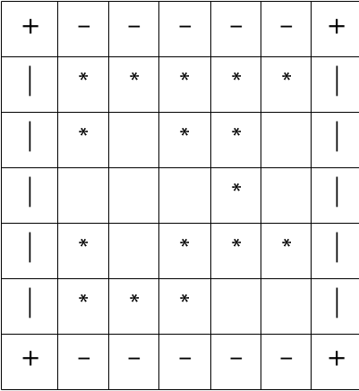
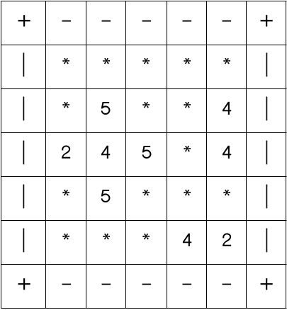
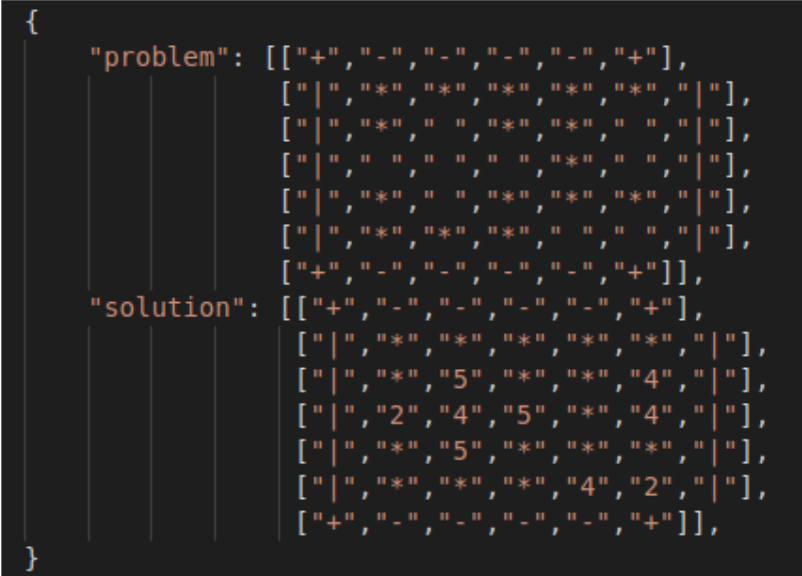

# BOMB NEIGHBOARDS OF TERROR

Todos conocemos o alguna vez usamos para distraernos el famoso Buscaminas en esta especial,\
oportunidad nuestro reto técnico tiene como finalidad resolver un mapa de dicho juego hemos preparado
un API disponible en https://mine-sweeper-generator.herokuapp.com/solver en el cual un generador
de mapas aleatorios te permite recibir una matriz que representa a un Array bidimensional como se
muestra en el siguiente ejemplo:

El problema se declara como resuelto cuando encontramos cantidad de bombas adyacentes de una casilla
sin bomba, con lo cual el ejemplo anterior tiene como solución la siguiente forma:

Esta matriz llena representa la solución del problema planteado en el mapa 1, para disponibilizar los datos
debe exponerse una API ( Recomendamos usar heroku ), usando una nomenclatura similar a la expuesta en https://mine-sweeper-generator.herokuapp.com/solver,
pero con la peculiaridad que la respuesta de tu API debe tener 2 objetos en la salida , uno para el mapa
por resolver y el otro con el mapa resuelto algo similar a lo que representamos a continuación :

